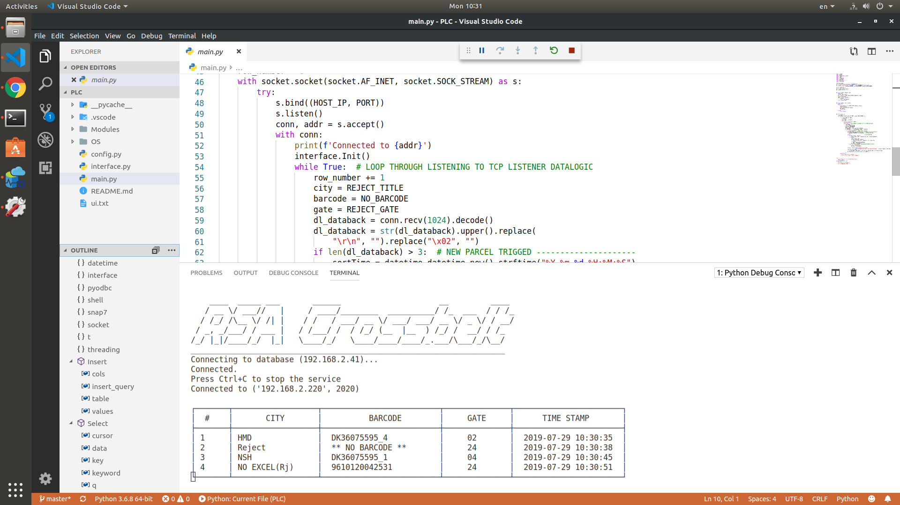

# Siemens PLC s7 | PYTHON
Simple write and read  on plc s7

## What you need


You should download following link:
wget http://sourceforge.net/projects/snap7/files/1.2.1/snap7-full-1.2.1.tar.gz/download
or I put this version on 📂**OS/** 

- [ ] On Debian-base OS:
```bash
tar -zxvf snap7-full-1.2.1.tar.gz
cd snap7-full-1.2.1/build/unix && sudo make -f arm_v6_linux.mk all
sudo cp ../bin/arm_v6-linux/libsnap7.so /usr/lib/libsnap7.so
sudo cp ../bin/arm_v6-linux/libsnap7.so /usr/local/lib/libsnap7.so
sudo apt-get install python3-pip
sudo pip3 install python-snap7
sudo ldconfig
```

- [ ] On Windows Only copy files on 📂**OS/** to System32 folder
Here is the code:

```python

import snap7

plc = snap7.client.Client()
plc.connect('192.168.2.100', 0, 1)

```


## How to Connect to SQL server via Command line (shell)
```bash
tsql -H 192.168.2.82 -U 'sa' -P '123456789' -p 1433
```
### List all of the tables
sp_help # end withs 'user table'
or you can use Sql Server Operation Studio
[Microsoft SQLSOS Dowload Link](https://docs.microsoft.com/en-us/sql/azure-data-studio/download?view=sql-server-linux-2017)

## Mount a network folder (windows share)
```bash
sudo apt-get install cifs-utils # only first time make sure this utility is installed
sudo mount -t cifs //192.168.1.10/sharedfolder ./path/to/mount/ -o username=peyman,password=1234567890
```
)

<span style="color:red">Happy Codding 🍓</span>

> Peyman Majidi 
